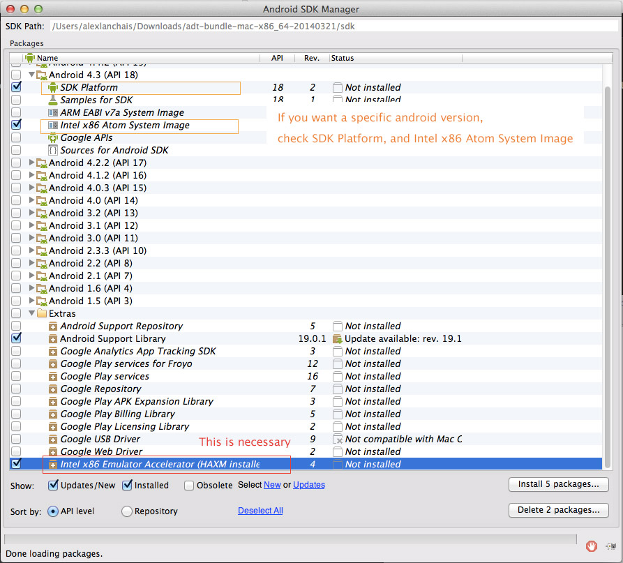
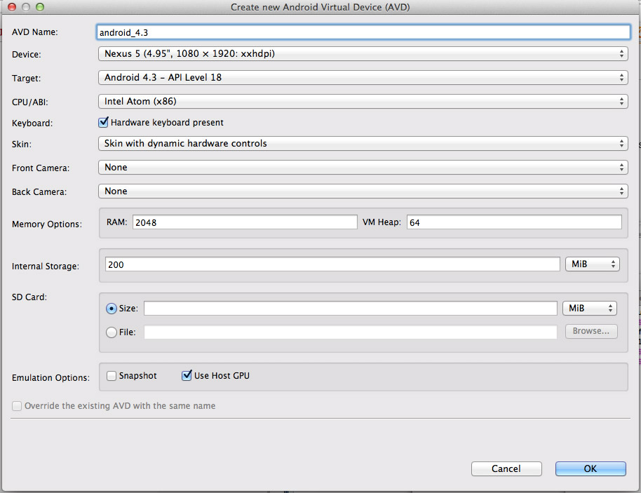

Installing Android Emulator with Intel HAXM and Chrome app
================


[Download the Android SDK Bundle](http://developer.android.com/sdk/index.html)

Unzip after download

Open your .bash_profile, let's add 'android' to our PATH environment variable

```
export PATH=<path_to_android_sdk>/platform-tools:<path_to_android_sdk>/tools:$PATH
```
where `<path_to_android_sdk>` is to be replaced with the path to your SDK. For example: "`/Users/me/android-sdk-mac_86/platform-tools`"

Open terminal, then run
`android sdk`

It might prompt you to install/update Java, after that just run `android sdk` again

Refer to the screenshot for what you want/need.


After you checked what you need, click "Install XX Packages..."
(Intel HAXM is a hardware-assisted virtualization engine to speed up Android app emulation, it's nice).

Go back to finder window
Find your extracted SDK bundle -> extras/intel/Hardware_Accelerated_Execution_Manager/

Run IntelHAXM_1.0.8.dmg

Follow the prompts. You can adjust your Memory Allocation (I'm using 4096 MB, out of 32 GB)

To verify that Intel HAXM is running, open a terminal window and execute the following command:

`kextstat | grep intel`

If Intel HAXM is operating correctly, the command will show a status message indicating that the kernel extension named "com.intel.kext.intelhaxm" is loaded.

In terminal, run
`android avd`

Create a new AVD

Use the settings in screenshot

Adjust your AVD Name, Device, and Target as necessary. Select the Skin, and check 'Use Host GPU'

Start it

Now, you're set from here - you can view the default Android browser, but if you want chrome installed...

You have to download the apk and install it via command line. (this apk might not work depending on whatever android version you installed in your SDK. You can try a google search)

[Download the apk](http://appium.s3.amazonaws.com/com.android.chrome-1.apk)

Open terminal and run
`adb install /path/to/your/chrome.apk`

Might take a minute

If you get 'Success', the chrome app icon should appear in your emulator.

Remote Debugging on Android Emulator with Chrome
-------------

Open chrome in your emulator, go to Settings > Developer Tools

Check 'Enable USB Web Debugging'

Open Chrome on your desktop. Go to Settings (hamburger icon) > Tools > Inspect Devices

Make sure 'Discover USB devices' is checked

Open terminal and run `adb forward tcp:9222 localabstract:chrome_devtools_remote`

If you go back to chrome on your desktop, you should see your Android SDK show up, with your tabs listed below to inspect.
